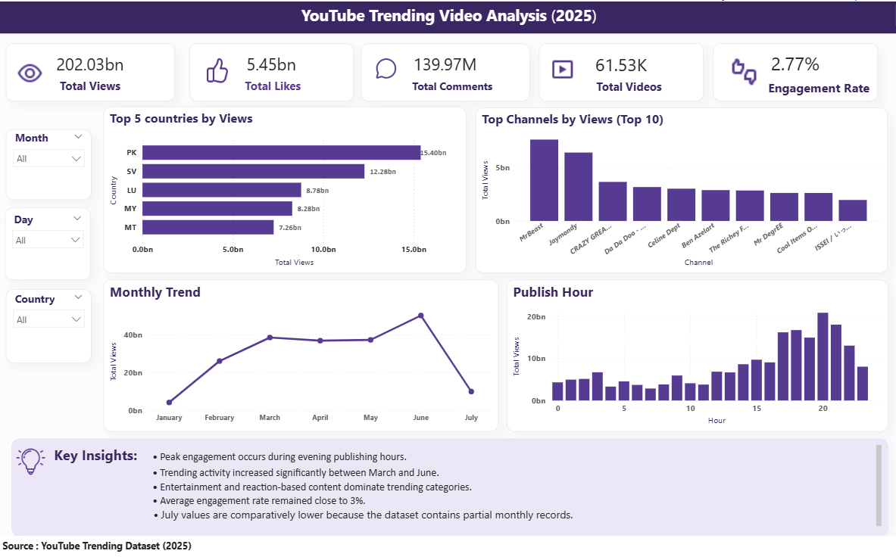
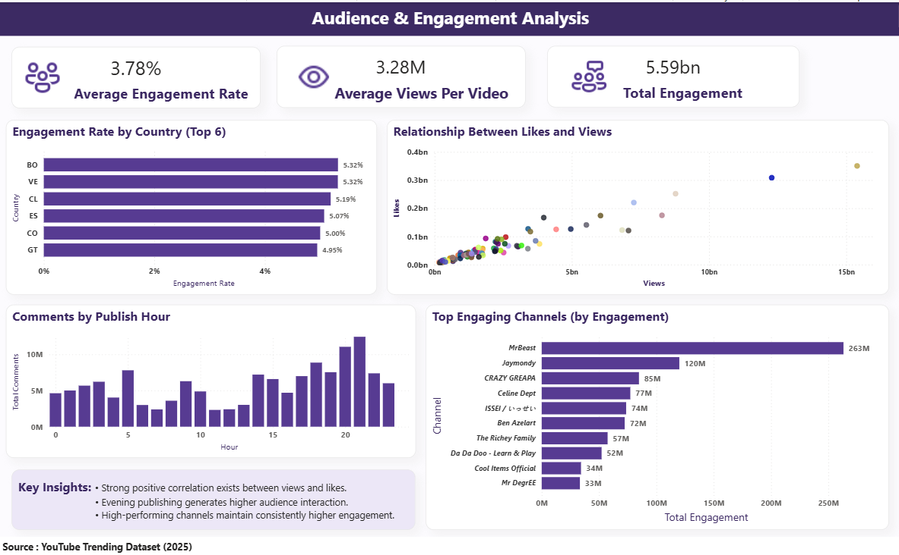
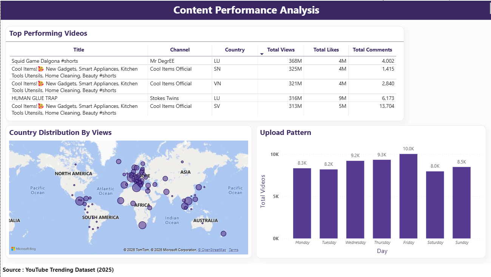
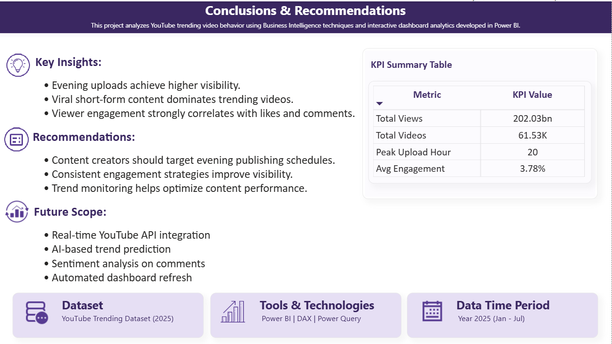

# YouTube Trending Video Analysis using Power BI



## Project Overview

This project analyzes YouTube Trending Video data using Microsoft Power BI to identify audience engagement patterns, content performance trends, publishing behavior, and geographic visibility. The project demonstrates the complete Business Intelligence workflow, including data cleaning, ETL transformation, DAX measure creation, KPI reporting, and dashboard development.

The objective of the project is to transform raw social media interaction data into meaningful insights that can help content creators, marketers, and analysts better understand audience behavior and content performance.

---

## Dataset Information

The project uses a YouTube Trending Videos dataset containing information such as:

* Video Title
* Channel Name
* Country
* Publishing Date
* Views
* Likes
* Comments
* Category Information
* Engagement-related Metrics

The dataset was cleaned and transformed using Power Query before being used for dashboard development and KPI analysis.

---

## Project Workflow

1. Data Collection
2. Data Cleaning and Transformation using Power Query
3. ETL Processing and Data Modeling
4. DAX Measure Creation
5. Dashboard Development
6. KPI Analysis and Insight Generation
7. Business Insight Reporting

---

## Tools & Technologies

* Microsoft Power BI
* Power Query
* DAX
* Data Cleaning
* ETL Processing
* Data Modeling
* Data Visualization
* Dashboard Development

---

## Data Preparation

Several preprocessing and transformation steps were performed before dashboard development:

* Data Type Conversion
* Date and Time Transformation
* Duplicate Record Handling
* Group By Transformation
* Merge Queries
* Data Cleaning
* Column Renaming
* Data Modeling

One of the major challenges during implementation was handling duplicate trending records. Since videos appeared multiple times in the trending list across different dates, a Group By transformation was used to identify the highest-performing record for each video. Merge Queries were then used to restore related attributes and improve KPI accuracy.

---

## KPIs Used

The following KPIs were developed using DAX:

* Total Views
* Total Likes
* Total Comments
* Total Engagement
* Engagement Rate
* Average Views per Video

These KPIs were used throughout the dashboards to support performance analysis and audience engagement reporting.

---

## Dashboard Pages

### 1. Executive Dashboard

Provides a high-level overview of platform performance through KPI cards, monthly trends, country-wise analysis, and publishing-time analysis.

### 2. Audience & Engagement Dashboard

Analyzes audience interaction using likes, comments, engagement rate, and channel-level engagement performance.

### 3. Content Performance Dashboard

Highlights top-performing videos, geographic distribution, content visibility patterns, and publishing behavior.

### 4. Conclusion & Recommendation Dashboard

Summarizes key findings, recommendations, KPI insights, and future enhancement opportunities.

---

## Key Insights

* Audience engagement strongly influences trending visibility.
* Videos uploaded during evening hours generally achieved higher engagement.
* Consistent publishing schedules improved content performance.
* Engagement quality provided deeper insights than view counts alone.
* Geographic differences affected audience behavior and visibility.
* Interactive dashboards simplified interpretation of large datasets through KPI reporting and visual analytics.

---

## Dashboard Preview

### Executive Dashboard


### Audience & Engagement Dashboard



### Content Performance Dashboard



### Conclusion Dashboard



---

## Skills Demonstrated

* Data Cleaning
* ETL Processing
* Power Query
* DAX Calculations
* KPI Development
* Data Modeling
* Dashboard Design
* Data Visualization
* Business Intelligence Reporting
* Analytical Thinking

---

## Repository Structure

```text
youtube-trending-video-analysis-powerbi/
│
├── dashboard_screenshots/
│   ├── 01_executive_dashboard.png
│   ├── 02_audience_engagement_dashboard.png
│   ├── 03_content_performance_dashboard.png
│   └── 04_conclusion_dashboard.png
│
├── Dataset/
│
├── Power BI File/
│
├── Report/
│
└── README.md
```

---

## Author

**Nikita Oli**

Data Analytics | SQL | Power BI | Business Intelligence
